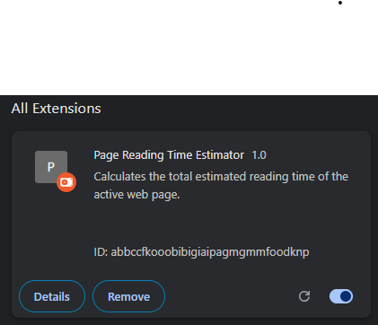
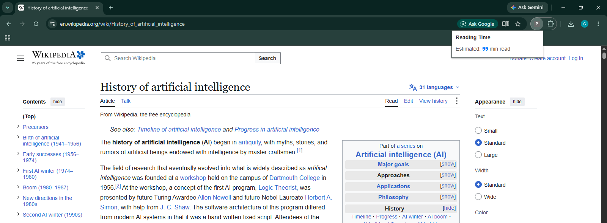
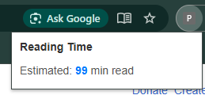

# 📖 Page Reading Time Estimator

A lightweight Chrome extension (Manifest V3) that scans the text of the web page you're viewing and tells you how long it will take to read.



***

## ✨ Features

-   One-click reading time estimate for any web page
-   Uses the `activeTab` and `scripting` permissions only, so it never runs in the background
-   Based on the average reading speed of **200 words per minute**
-   Clean, minimal popup interface
-   Gracefully handles unsupported pages (e.g. `chrome://` URLs)

***

## 📸 Screenshots

### Reading time result





## 🗂️ Project Structure

```
page-reading-time-extension/
├── manifest.json     # Extension configuration (Manifest V3)
├── popup.html        # Popup interface
├── popup.js          # Logic: injects script, counts words, calculates time
├── screenshots/      # Images used in this README
└── README.md
```

***

## 🚀 Installation

1.  Clone this repository:

```bash
git clone https://github.com/Engr-Brandon/Estimate-webpage-reading-time-chrome-extension.git
```

2.  Open Google Chrome and go to `chrome://extensions`.
3.  Turn on **Developer mode** (top-right toggle).
4.  Click **Load unpacked** and select the project folder.
5.  Pin the extension to your toolbar for quick access.

***

## 🧭 Usage

1.  Open any article, blog post, or web page.
2.  Click the extension icon in your toolbar.
3.  The popup shows the estimated reading time in minutes.

***

## ⚙️ How It Works

1.  `popup.js` finds the active tab with `chrome.tabs.query`.
2.  It injects a function into the page using `chrome.scripting.executeScript`.
3.  The function reads `document.body.innerText` and splits it into words.
4.  The popup calculates the time:

```
reading time = ceil(word count / 200)
```

5.  The result is displayed in the popup.

***

## 🔐 Permissions

| Permission  | Why it's needed                                             |
|-------------|-------------------------------------------------------------|
| `activeTab` | Temporary access to the current tab when you click the icon |
| `scripting` | Runs the word-counting function inside the page             |

No data is collected, stored, or sent anywhere.

***

## 🤝 Contributing

Contributions are welcome!

1.  Fork the repository
2.  Create a feature branch: `git checkout -b feature/my-feature`
3.  Commit your changes: `git commit -m "Add my feature"`
4.  Push to the branch: `git push origin feature/my-feature`
5.  Open a Pull Request

***

## 📄 License

This project is licensed under the [MIT License](LICENSE).

***

## 🙌 Acknowledgements

Inspired by existing reading-time extensions such as [d-bucur/reading-time-extension](https://github.com/d-bucur/reading-time-extension).
